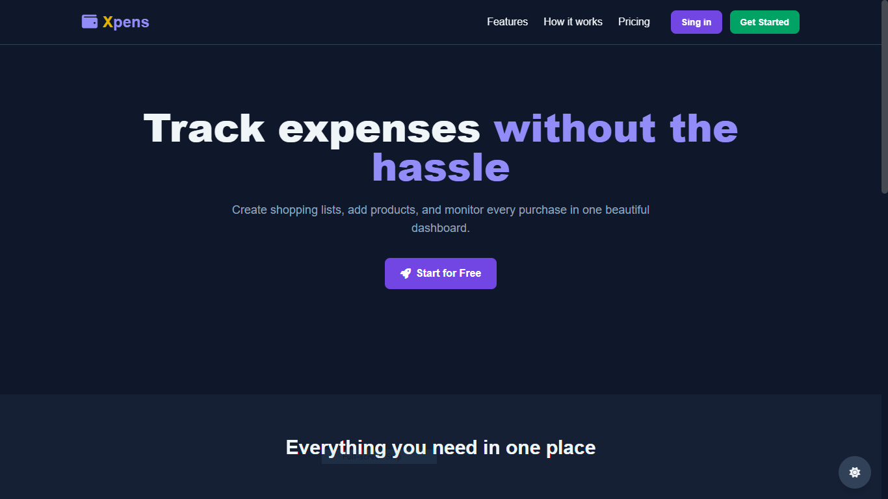
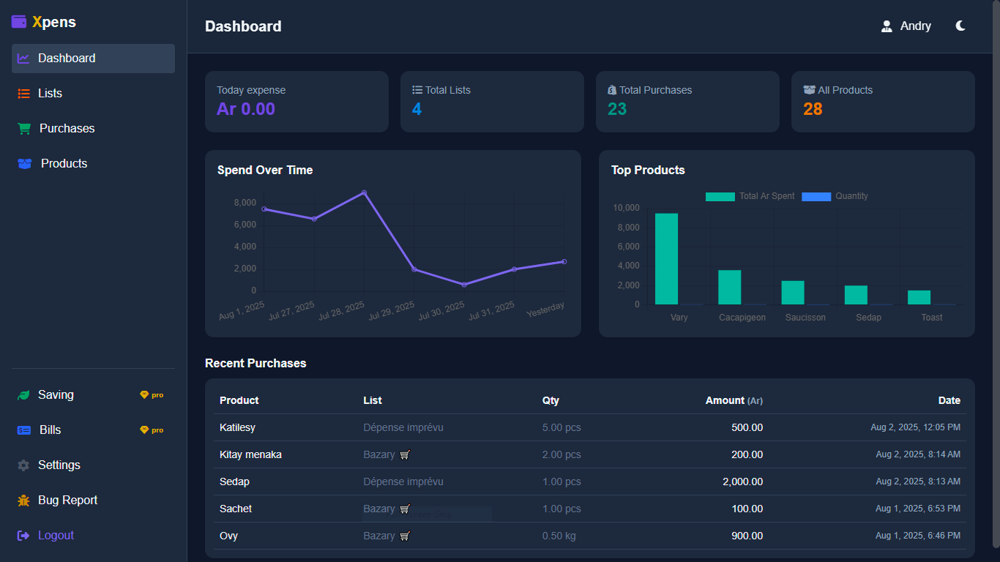
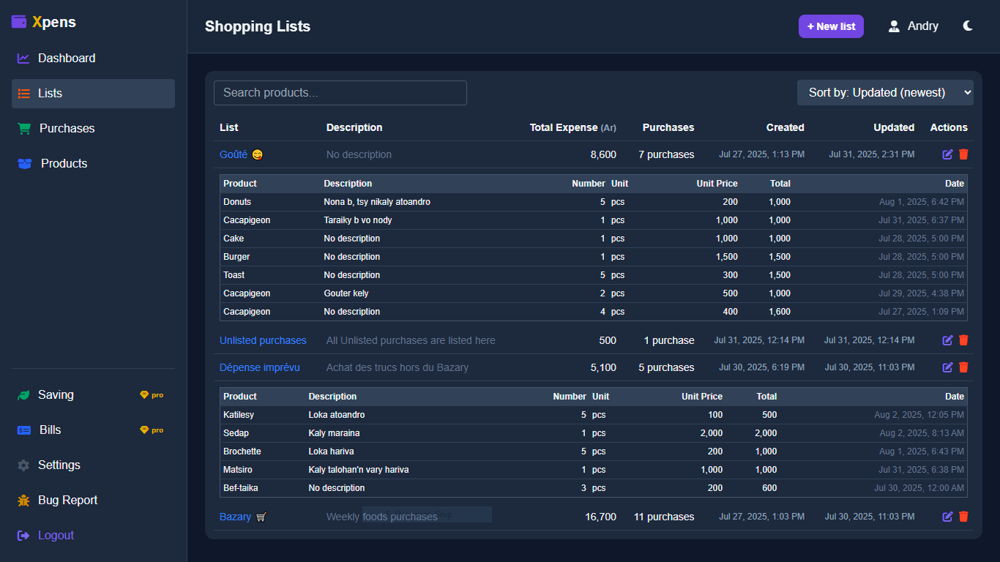
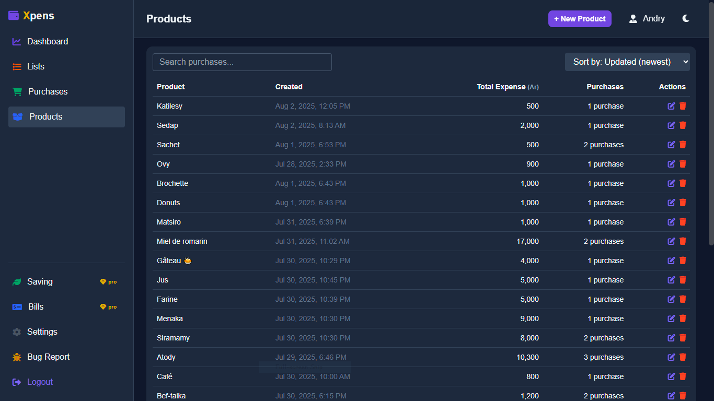
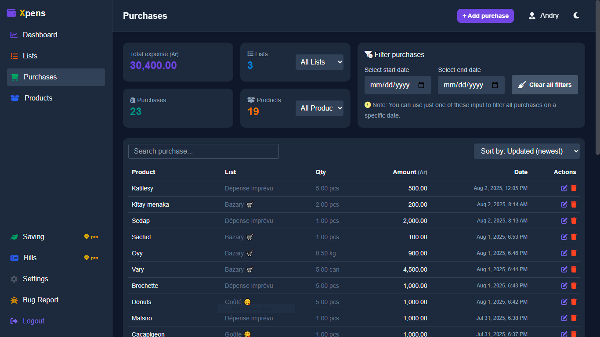
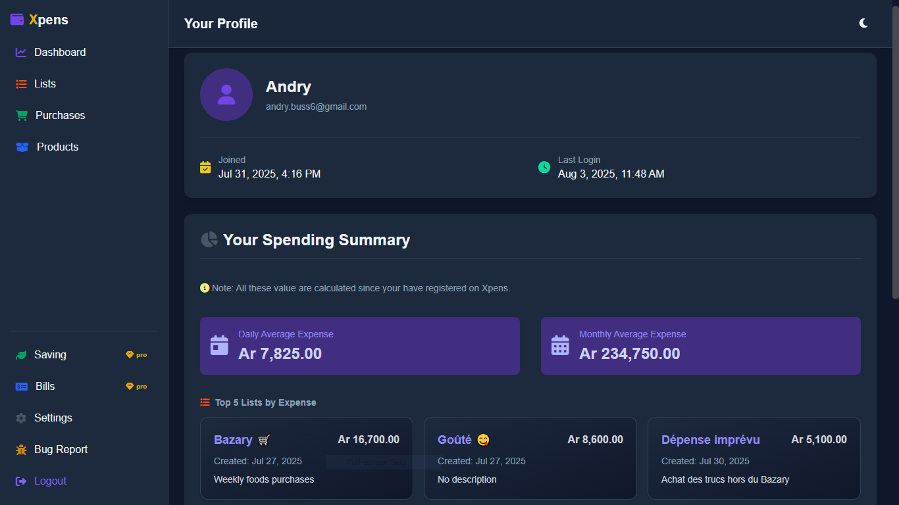

# Xpens

A simple expense tracking application.

## Features

### Authentication
- **User Registration:** Create a new user account.
- **User Login:** Authenticate and start a session.
- **User Logout:** Terminate the current session.

### User Management
- **Get All Users:** Retrieve a list of all registered users.

### List Management
- **Create Lists:** Add new shopping or expense lists.
- **View Lists:** See all lists belonging to the authenticated user.
- **Update Lists:** Modify the name or description of existing lists.
- **Delete Lists:** Remove unwanted lists.

### Product Management
- **Create Products:** Add new products that can be purchased.
- **View Products:** Get a list of all available products.
- **Update Products:** Change the name of a product.
- **Delete Products:** Remove products from the system.

### Purchase Tracking
- **Log Purchases:** Record new purchases with details like number of items, unit, unit price, and description.
- **View Purchases:** Get a complete history of all purchases.
- **Update Purchases:** Modify details of a previously logged purchase.
- **Delete Purchases:** Remove purchase records.

### Expense Filtering and Reporting
- **Filter by List:** View all purchases associated with a specific list.
- **Filter by Date:** See all purchases made on a particular date.
- **Filter by Date Range:** Analyze expenses within a specific period.
- **Total Expense by Product:** Calculate the total amount spent on a single product.
- **Total Expense by Date:** Sum up all expenses for a specific day.
- **Total Expense by Date Range:** Get the total expenses over a range of dates.

## Gallery
### Xpens Home Page

### Xpens Dashboard Page

### Xpens Lists Page

### Xpens Products Page

### Xpens Purchases Page

### Xpens Profile Page



## Getting Started

These instructions will get you a copy of the project up and running on your local machine for development and testing purposes.

### Prerequisites

*   PHP 
*   MySQL
*   A web server (e.g., Apache, Nginx); i made it with PHP 7.3.12 using the Development Server

### Installation

1.  Clone the repo
    ```sh
    git clone https://github.com/Andry-GitCrs/Xpens.git
    ```
2.  Create a `.env` file in the root directory and add the following environment variables:
    ```
    DB_HOST=your_db_host
    DB_NAME=your_db_name
    DB_USER=your_db_user
    DB_PASS=your_db_password
    ```
3.  Run 
    ```sh
    php -S localhost:8000
    ``` 
4. Navigate to `/` in your browser to initialize the database tables.

## API Endpoints

The following are the available API endpoints:

*   `api/auth/`
*   `api/lists/`
*   `api/products/`
*   `api/purchases/`
*   `api/users/`

For more details, please refer to the code.

## Database Schema

The database schema is defined in `config/init.php`. It consists of the following tables:

*   `users`
*   `lists`
*   `products`
*   `purchases`